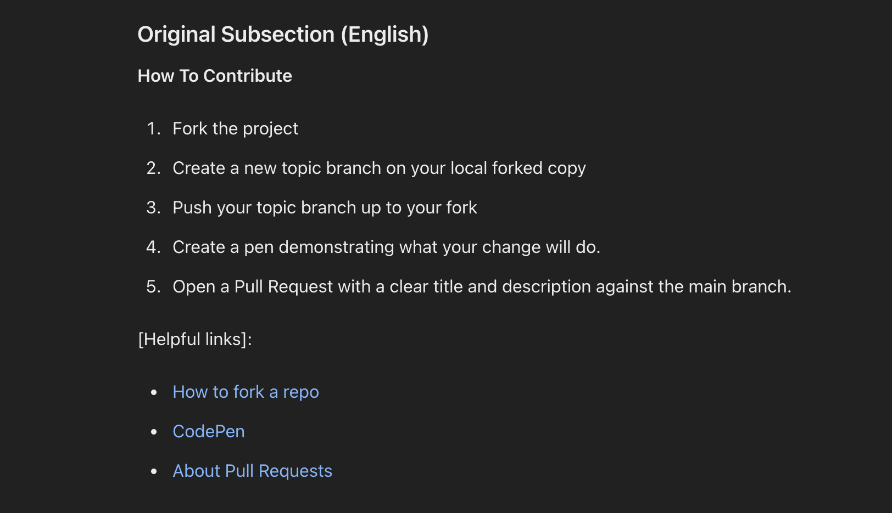
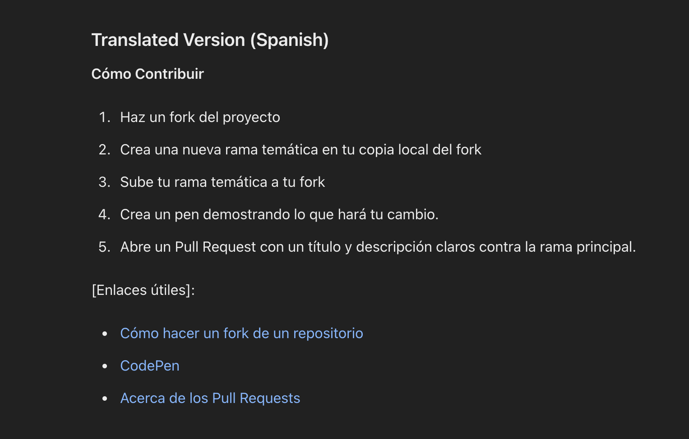
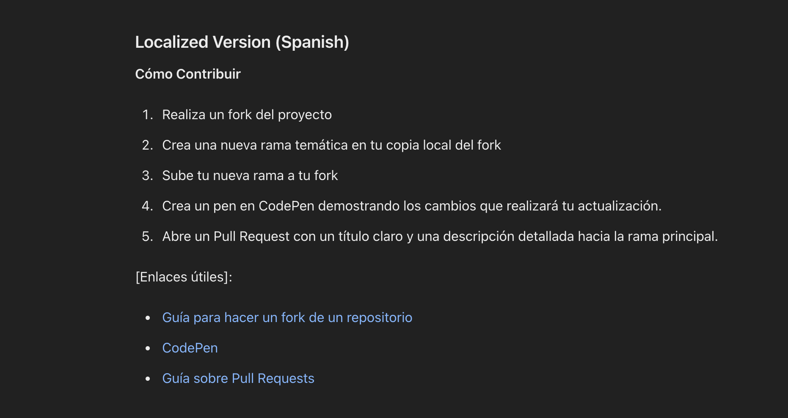
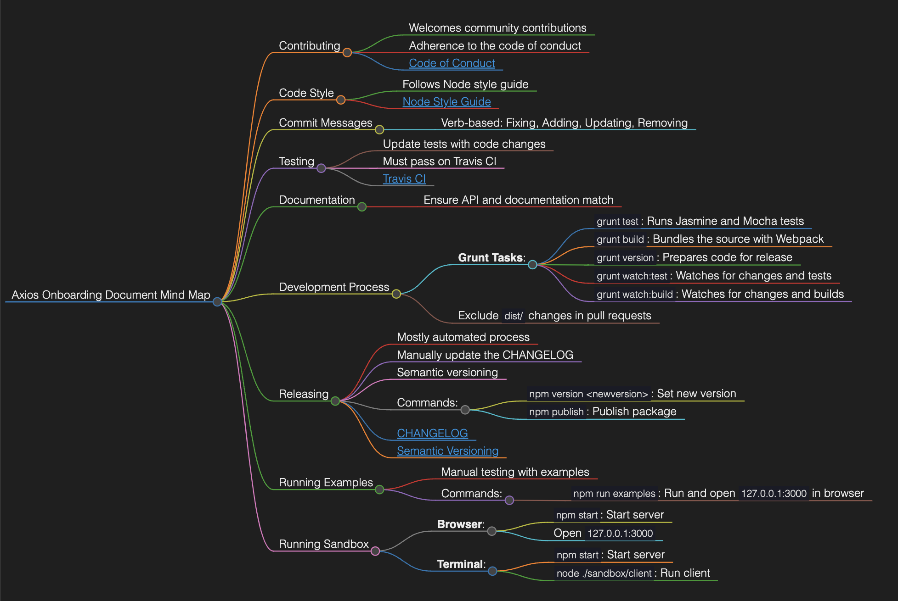

# Towards Leveraging LLMs for Reducing Open Source Onboarding Information Overload

Consistent, diverse, and quality contributions are essential to the
sustainability of the open source community. Therefore, it is im-
portant that there is infrastructure for effectively on-boarding and
retaining diverse newcomers to open source software projects. Most
often, open source projects rely on onboarding documentation to
support newcomers in making their first contributions. Unfortu-
nately, prior studies suggest that information overload from avail-
able documentation, along with the predominantly monolingual
nature of repositories, can have negative effects on the newcomer
experiences and onboarding process. This, coupled with the effort
involved in creating and maintaining onboarding documentation,
suggest a need for support in creating more accessible documenta-
tion. Large language models (LLMs) have shown great potential in
providing text transformation support in other domains, and even
shown promise in simplifying or generating other kinds of com-
puting artifacts, such as source code and technical documentation.
We contend that LLMs can also help make software on-boarding
documentation more accessible, thereby reducing the potential for
information overload. Using ChatGPT (GPT-3.5 Turbo) and Gem-
ini Pro as case studies, we assessed the effectiveness of LLMs for
simplifying software on-boarding documentation, one method for
reducing information overload. We discuss a broader vision for us-
ing LLMs to support the creation of more accessible documentation
and outline future research directions toward this vision. 

**VISION**

EXAMPLE SHOWING TRANSLATION AND LOCALIZATION TO SPANISH
********************************************************
ENGLISH VERSION
********************************************************
 
********************************************************
SPANISH VERSION
********************************************************
 
********************************************************
SPANISH LOCALIZED VERSION
********************************************************
 

The Localized version adjusts phrases to sound more natural and familiar to Spanish-speaking users, making minor modifications to fit local expressions.

VISUALIZATION USING MIND-MAPS
********************************************************
EXAMPLE SHOWING VISUALIZATION OF AXIOS OPEN-SOURCE PROJECT
********************************************************
 
